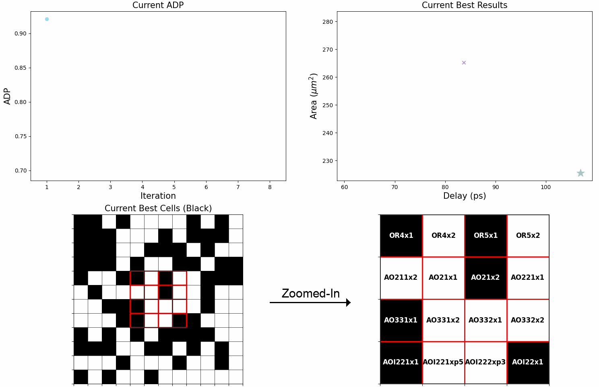

# MapTune: Advancing ASIC Technology Mapping via Reinforcement Learning Guided Library Tuning (ICCAD'24)

## Overview
This repository contains the implementation and scripts used for the experiments in the ICCAD'24 paper "MapTune: Advancing ASIC Technology Mapping via Reinforcement Learning Guided Library Tuning". The experiments involve selected real world ISCAS 85/89/99, VTR 8.0, and EPFL designs mapped with four different technology libraries using ABC built-in mapper tuned by our MapTune Framework.


(This is the visualization of the tuning process of mapping Design s838a.bench using ASAP7 library tuned by `MapTune-ε` (Multi-Armed Bandit with Epsilon Greedy policy) agent mapped with ABC built-in default delay-driven mapper.)

## Directory Structure
- `benchmarks`: Contains selected designs from ISCAS 85/89/99, VTR 8.0, and EPFL benchmark suites.
- `temp_blifs`: Contains the temporary blif files generated by ABC during technology mapping.
- `gen_newlibs`: Contains the new sampled genlibs where various RL agents select certain cells from the original genlib.

## Scripts and Usage

### `MAB_EP.py` & `batched_MAB_EP.py`
These scripts implement Multi-Armed Bandit with Epsilon Greedy Policy (`MapTune-ε`) agent and its batched version to tune the technology mapping process. 
- **Usage:** 
  ```bash
  python MAB_EP.py <num_sampled_gate> <design> <genlib>
  python batched_MAB_EP.py <num_sampled_gate> <design> <genlib> (By default, BS = 10)
  ```
  - **Parameters:**
    - `num_sampled_gate`: The number of sampled gates. Note that, we pre-select certain **Inverter** and **Buffer** gates (10 to 20 gates, varies by different genlib) to be included in the newly generated sampled genlib to ensure the correctness of ABC technology mapping. **num_sampled_gate** only specifies how many gates will be sampled from the original genlib, excluding the pre-selected gates. This standard is maintained throughout all experiments.
    - `design`: The name of the design.
    - `genlib`: The name of the genlib.

- **Example:**
  ```bash
  python MAB_EP.py 65 benchmarks/s838a.bench 7nm.genlib
  ```
  ```bash
  python batched_MAB_EP.py 65 benchmarks/s838a.bench 7nm.genlib
  ```
### `MAB_UCB.py` & `batched_MAB_UCB.py`
These scripts implement Multi-Armed Bandit with Upper Confidence Bound (UCB) Policy (`MapTune-UCB`) agent and its batched version to tune the technology mapping process.
- **Usage:**
  ```bash
  python MAB_UCB.py <num_sampled_gate> <design> <genlib>
  python batched_MAB_UCB.py <num_sampled_gate> <design> <genlib> (By default, BS = 10)
  ```
  - **Parameters:**
    - `num_sampled_gate`: The number of sampled gates.
    - `design`: The name of the design.
    - `genlib`: The name of the genlib.

- **Example:**
  ```bash
  python MAB_UCB.py 65 benchmarks/s838a.bench 7nm.genlib
  ```
  ```bash
  python batched_MAB_UCB.py 65 benchmarks/s838a.bench 7nm.genlib
  ```

#### Alternatively, we had implemented the C version for both MapTune-ε and MapTune-UCB agents which are intended for further ABC integration (TBD).

### `MAB_EP_C.c`
This script implements C version of `MapTune-ε` agent to tune the technology mapping process.
- **Example:**
  ```bash
  gcc -o MAB_EP_C MAB_EP_C.c -lm 
  ./MAB_EP_C 65 benchmarks/s838a.bench 7nm.genlib
  ```
### `MAB_EP_UCB.c`
This script implements C version of `MapTune-UCB` agent to tune the technology mapping process.
- **Example:**
  ```bash
  gcc -o MAB_UCB_C MAB_UCB_C.c -lm
  ./MAB_UCB_C 65 benchmarks/s838a.bench 7nm.genlib
  ```
### `batched_DQN.py` & `batched_DDQN.py`
These scripts implement DQN and DDQN (`MapTune-DQN` & `MapTune-DDQN`) agents to tune the technology mapping process.
- **Usage:**
  ```bash
  python batched_DQN.py <num_sampled_gate> <design> <genlib> (By default, BS = 10)
  python batched_DDQN.py <num_sampled_gate> <design> <genlib> (By default, BS = 10)
  ```
  - **Parameters:**
    - `num_sampled_gate`: The number of sampled gates.
    - `design`: The name of the design.
    - `genlib`: The name of the genlib.

- **Example:**
  ```bash
  python batched_DQN.py 65 benchmarks/s838a.bench 7nm.genlib
  ```
  ```bash
  python batched_DDQN.py 65 benchmarks/s838a.bench 7nm.genlib
  ```

## How to Run Experiments
To run the experiments as described in the ICCAD'24 paper, use the provided scripts with the appropriate parameters as outlined above. Ensure all dependencies are installed and properly configured.
- Python version: Python 3.8.16
- CUDA version: V11.5.119
- GCC version: gcc (GCC) 8.5.0
- ABC: add your ABC path to the current directory and run the experiments. 
  ```bash 
  export PATH=/your/path/to/ABC:${PATH}
  ```

## License

MIT License

## Acknowledgments

This work is funded by the National Science Foundation (NSF) under awards NSF 2229562, 2349670, 2349461, and 2403134, and University of Maryland.

## Bibtex
```
@misc{liu2024maptuneadvancingasictechnology,
      title={MapTune: Advancing ASIC Technology Mapping via Reinforcement Learning Guided Library Tuning}, 
      author={Mingju Liu and Daniel Robinson and Yingjie Li and Cunxi Yu},
      year={2024},
      eprint={2407.18110},
      archivePrefix={arXiv},
      primaryClass={cs.AR},
      url={https://arxiv.org/abs/2407.18110}, 
}
```
