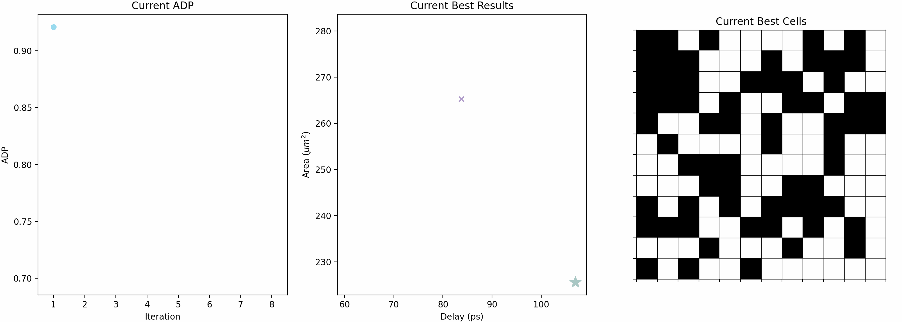

# MapTune: Advancing ASIC Technology Mapping via Reinforcement Learning Guided Library Tuning (ICCAD'24)

## Overview
This repository contains the implementation and scripts used for the experiments in the ICCAD'24 paper "MapTune: Advancing ASIC Technology Mapping via Reinforcement Learning Guided Library Tuning". The experiments involve selected real world ISCAS 85/89/99, VTR 8.0, and EPFL designs with four different types of technology library with ABC built-in mapper.


(This is the visulization for the optimization process of Design s838a.bench tuned by MAB-EP(Epsilon Greedy) agent mapped with ABC mapper using ASAP7 library.

## Directory Structure
```plaintext
benchmarks: Contains selected designs from ISCAS 85/89/99, VTR 8.0, and EPFL benchmark suites.
temp_blifs: Contains the temporary blif files generated by ABC.
gen_newlibs: Contains the new genlibs by selecting a subset of the original genlib.
```

## Scripts and Usage

### `MAB_EP.py`
This script implements Multi-Armed Bandit with Epsilon Greedy Policy agent to tune the technology mapping process. 
- **Usage:** 
  ```bash
  python MAB_EP.py <num_sample_gate> <design> <genlib>
  ```
  - **Parameters:**
    - `num_sample_gate`: The number of sample gates
    - `design`: The name of the design.
    - `genlib`: The name of the genlib.

- **Example:**
  ```bash
  python MAB_EP.py 65 benchmarks/s838a.bench 7nm.genlib
  ```

## How to Run Experiments
To run the experiments as described in the ICCAD'24 paper, use the provided scripts with the appropriate parameters as outlined above. Ensure all dependencies are installed and properly configured.
- Python version: Python 3.8.16
- CUDA version: V11.5.119
- ABC: add your ABC path to the current directory and run the experiments. For example, export PATH=/your/path/to/ABC:${PATH}

## License

MIT License

## Acknowledgments

This work is funded by the National Science Foundation (NSF) under awards NSF 222956, 2349670, 2349461, and 2403134, and University of Maryland.

## Bibtex

```
```
